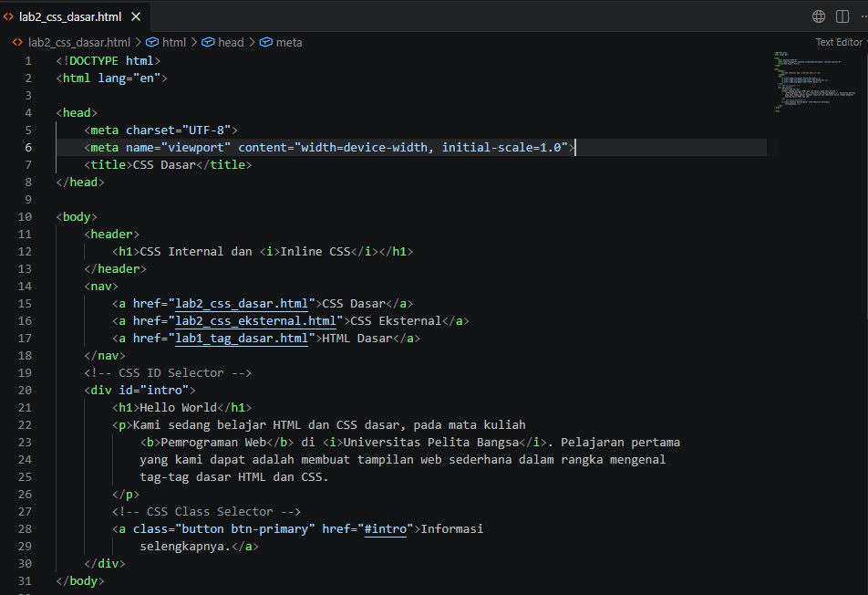
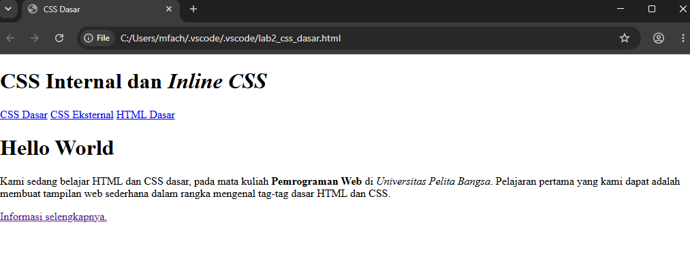
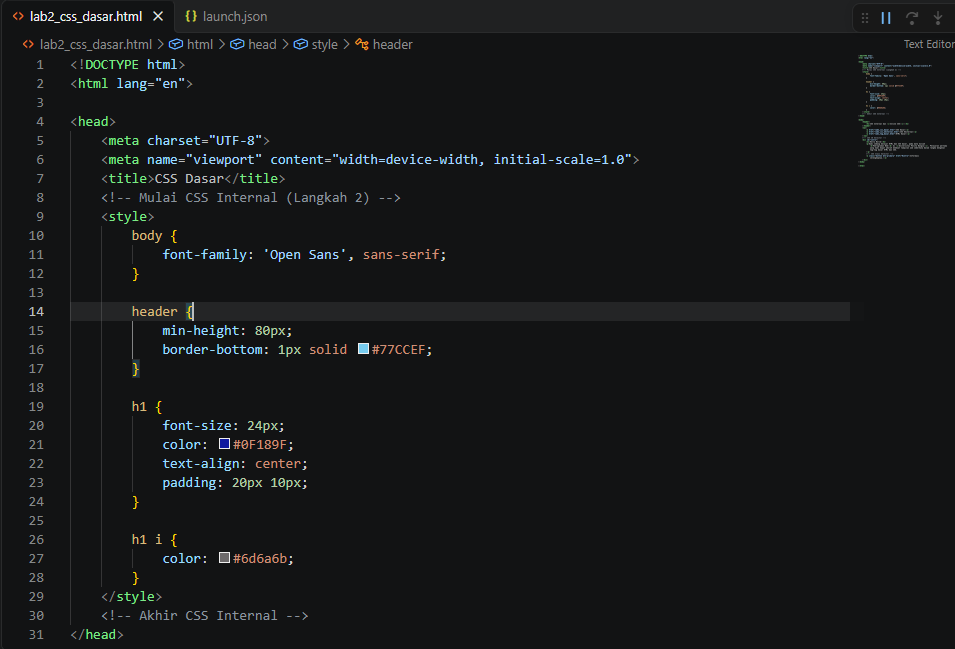
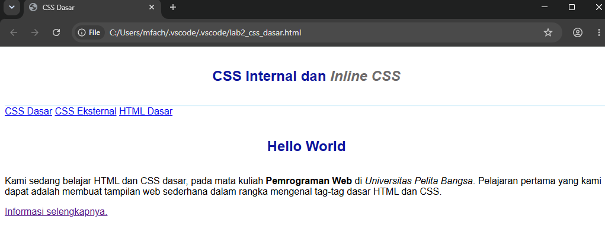
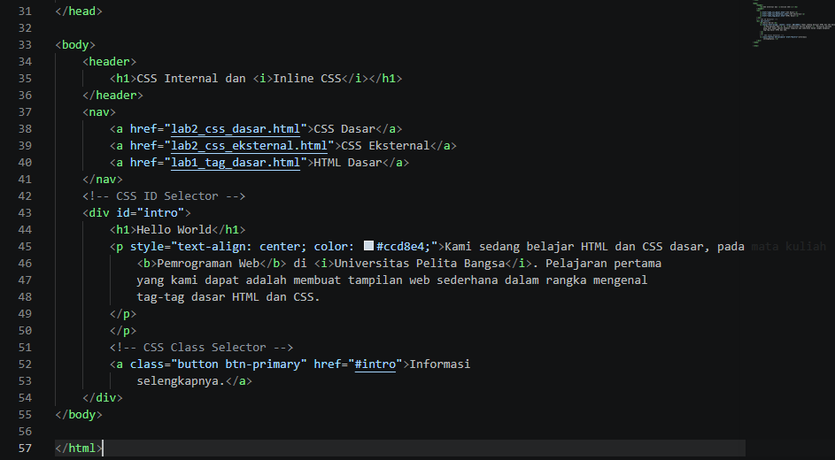
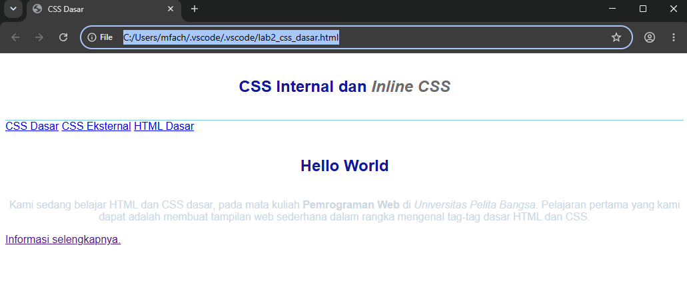
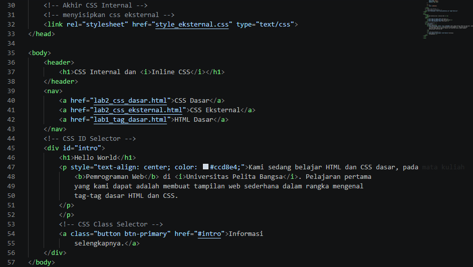
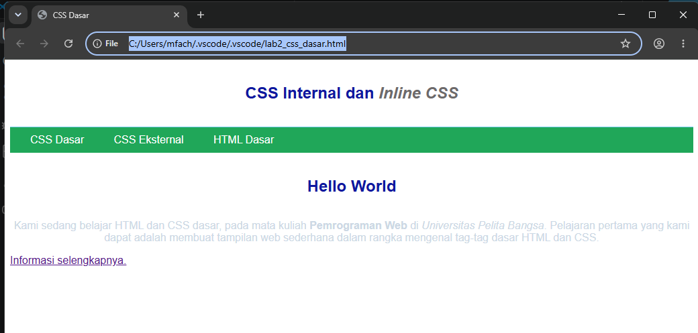
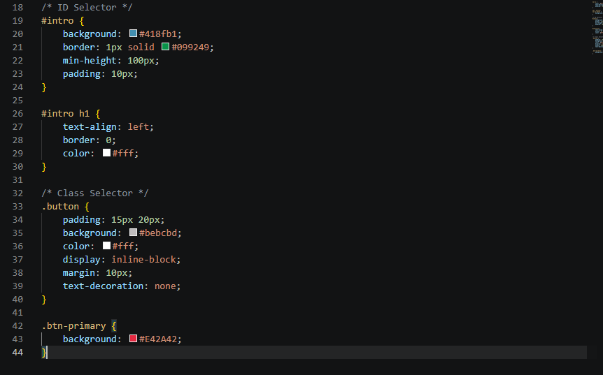
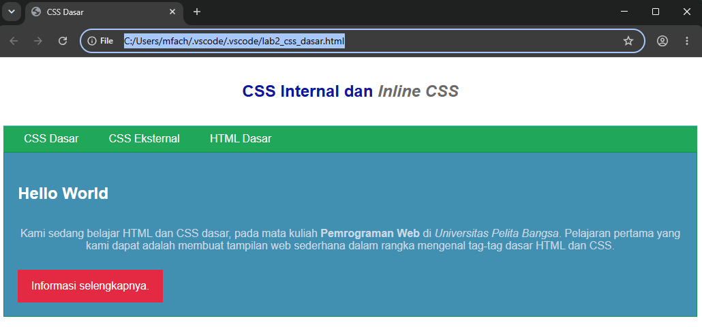

# Laporan Praktikum 3: CSS Dasar
**Mata Kuliah:** Pemrograman Web  
**Nama:** MUHAMMAD FACHRUDDIN  
**NIM:** 312510103  

## Langkah-langkah Praktikum

### 1. Membuat Dokumen HTML (`lab2_css_dasar.html`)
Pada langkah ini, dibuat kerangka dasar HTML yang berisi elemen header, navigasi, dan sebuah div konten.
- **Kode HTML di VS Code:**
  
- **Hasil Browser:**
  

### 2. Mendeklarasikan CSS Internal
Menambahkan tag `<style>` di dalam bagian `<head>` dokumen HTML untuk memberikan styling dasar pada `body`, `header`, dan elemen `h1`.
- **Kode Internal CSS:**
  
- **Hasil Browser:**
  Judul teks berubah menjadi rata tengah dan berwarna biru pudar/gelap.
  

### 3. Menambahkan Inline CSS
Menambahkan atribut `style` secara langsung di dalam tag `
` pembuka untuk mengatur rata tengah dan warna teks spesifik pada paragraf tersebut.
- **Kode Inline CSS:**
  
- **Hasil Browser:**
  Teks paragraf menjadi warna abu-abu kebiruan dan rata tengah.
  

### 4. Membuat CSS Eksternal
Membuat file baru `style_eksternal.css` dan menautkannya menggunakan tag `<link>` di bagian `<head>`. Ini berfungsi untuk memberikan styling warna pada menu navigasi.
- **Kode CSS Eksternal & HTML Link:**
  
- **Hasil Browser:**
  Menu navigasi berubah menjadi blok kotak dengan background warna hijau.
  

### 5. Menambahkan CSS Selector (ID dan Class)
Menambahkan aturan styling baru di file `style_eksternal.css` dengan memanggil ID `#intro` dan Class `.button` serta `.btn-primary`.
- **Kode CSS Selector:**
  
- **Hasil Browser:**
  Kotak konten memiliki background biru pudar, dan tombol "Informasi selengkapnya" berubah menjadi tombol warna merah.
  

---

## Jawaban Pertanyaan Praktikum

**1. Apa perbedaan pendeklarasian CSS elemen `h1 {...}` dengan `#intro h1 {...}`?**
- `h1 {...}` adalah **Element Selector**. Aturan ini bersifat global dan akan diterapkan ke *semua* tag `<h1>` yang ada di seluruh dokumen HTML tersebut.
- `#intro h1 {...}` adalah **Descendant Selector** yang lebih spesifik. Aturan ini *hanya* akan diterapkan pada tag `<h1>` yang posisinya berada di dalam elemen yang memiliki atribut `id="intro"`. Tag `<h1>` di luar elemen tersebut tidak akan terpengaruh bentuk dan warnanya.

**2. Apabila ada deklarasi CSS secara internal, lalu ditambahkan CSS eksternal dan inline CSS pada elemen yang sama. Deklarasi manakah yang akan ditampilkan pada browser?**
Sesuai prinsip *Cascading* (hierarki/tingkat prioritas CSS), **Inline CSS** memiliki bobot (*specificity*) yang paling tinggi. Oleh karena itu, deklarasi pada Inline CSS-lah yang akan diprioritaskan dan ditampilkan pada browser (menimpa aturan dari eksternal maupun internal).
- *Contoh:* Jika di eksternal/internal diset `p { color: red; }`, namun di dalam tag disisipkan `
`, maka teks pada browser akan tetap berwarna **biru**.

**3. Pada sebuah elemen HTML terdapat ID dan Class (`
`), apabila masing-masing selector tersebut terdapat deklarasi CSS, maka deklarasi manakah yang akan ditampilkan pada browser?**
Deklarasi yang akan ditampilkan adalah deklarasi yang berada pada **ID Selector** (`#paragraf-1`). Dalam aturan bobot CSS (*Specificity*), ID Selector memiliki nilai poin bobot yang jauh lebih tinggi (100) dibandingkan Class Selector (10). Jadi, meskipun properti yang diubah sama, nilai dari ID akan selalu memprioritaskan dan menimpa nilai dari Class.
- *Contoh:* Jika pada CSS ditulis `#paragraf-1 { background: yellow; }` dan `.text-paragraf { background: green; }`, maka paragraf akan memiliki latar belakang berwarna **kuning**.
